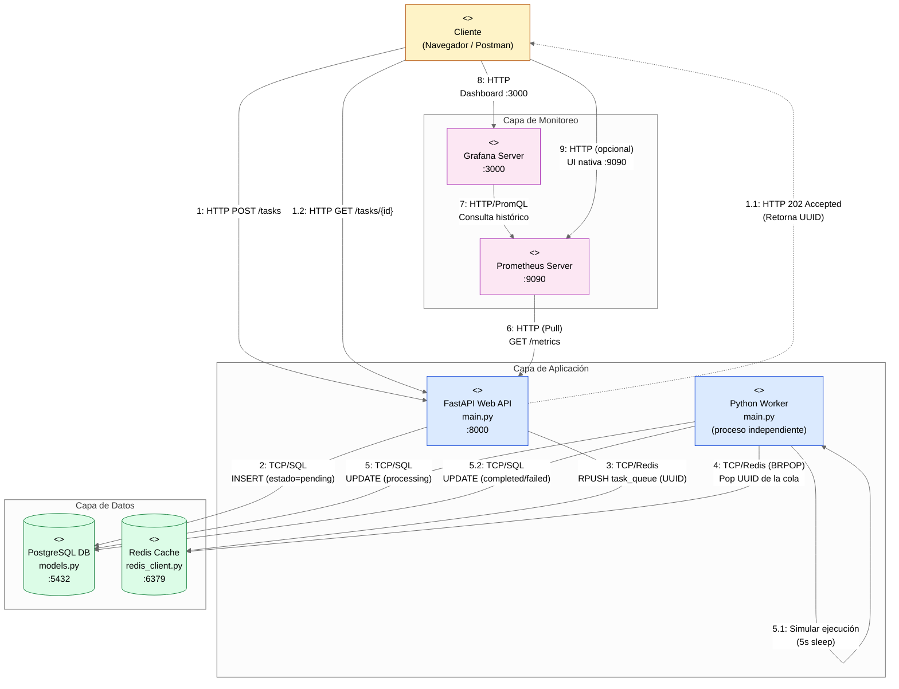

# 🚀 FastAPI Task Scheduler

API REST asíncrona de alto rendimiento desarrollada en **FastAPI** para el encolamiento de tareas pesadas, con procesamiento en background mediante un **Worker independiente**, persistencia en **PostgreSQL**, cola de mensajería en **Redis**, monitoreo con **Prometheus + Grafana**, y validaciones automatizadas mediante un pipeline de **CI (GitHub Actions)**.

---

## 🗺️ Diagrama de Arquitectura



---

## 💡 Justificación de Decisiones de Arquitectura

### 1. Desacoplamiento de la API y el Worker
Separar el servidor web de la API del proceso ejecutor de tareas (**Worker**) evita que las tareas pesadas (como cálculos matemáticos complejos, procesamiento de datos o peticiones externas de larga duración) bloqueen el ciclo de eventos (event loop) de FastAPI. Esto permite que la API siga recibiendo y respondiendo miles de peticiones por segundo con latencias mínimas.

### 2. Uso de `BRPOP` en Redis en lugar de Polling Activo
En [`worker/main.py`](worker/main.py), el Worker utiliza la operación bloqueante `brpop` de Redis con un tiempo de espera (`timeout=5`).
* **¿Por qué?** El *polling* activo (preguntar a Redis cada segundo mediante un loop continuo) consume recursos de CPU y genera tráfico de red innecesario.
* **Beneficio:** `BRPOP` suspende el hilo de ejecución de Python hasta que entra un elemento en la cola. Si la cola está vacía, el consumo de CPU del Worker es del 0%.

### 3. UUID como Clave Primaria en las Tareas
Las tareas se identifican mediante un identificador universal único (UUIDv4) en lugar de un entero secuencial (`1, 2, 3...`).
* **Seguridad (IDOR):** Evita que usuarios maliciosos puedan adivinar IDs de tareas ajenas incrementando secuencialmente el parámetro en el endpoint `GET /tasks/{id}`.
* **Escalabilidad:** Los UUID se pueden generar del lado del cliente o de la aplicación de forma distribuida sin riesgo de colisión y sin necesidad de sincronización centralizada en la base de datos.

### 4. Monitoreo mediante Modelo Pull (Prometheus)
FastAPI está instrumentado para exponer sus métricas operativas (latencia por percentiles, throughput de llamadas, códigos de estado) en `/metrics`. Prometheus consulta activamente este endpoint. Esto aísla a la API: si el servidor de monitoreo se cae, la API sigue funcionando al 100% de su capacidad sin bloquearse por intentar enviar logs o métricas.

---

## 🛠️ Comandos Rápidos (`Makefile`)

El proyecto cuenta con un [`Makefile`](Makefile) para simplificar la administración del entorno.

| Comando | Acción |
| :--- | :--- |
| `make run` | Construye las imágenes y levanta todo el entorno Docker (API, Worker, DB, Redis, Prometheus, Grafana) en segundo plano. |
| `make stop` | Apaga y detiene todos los contenedores de Docker sin perder los datos persistidos. |
| `make restart` | Realiza un reinicio rápido del entorno Docker. |
| `make logs` | Muestra la salida de logs en tiempo real de todos los contenedores. |
| `make test` | Ejecuta de forma aislada las pruebas unitarias e integración de la API usando `pytest`. |
| `make lint` | Ejecuta las validaciones de estilo de código (`black` y `flake8`). |
| `make format` | Formatea automáticamente el código del proyecto siguiendo el estándar PEP 8. |
| `make clean` | Apaga todos los contenedores y **elimina permanentemente** los volúmenes de datos de PostgreSQL y Grafana. |

---

## 🚀 Guía de Inicio Rápido

### Requisitos Previos
* **Docker** y **Docker Compose** instalados en el sistema.
* **Python 3.10+** (para desarrollo y pruebas locales).

### Paso 1: Configurar el Entorno Virtual (Local)
Para desarrollo, autocompletado y ejecución de pruebas locales:
```bash
python3 -m venv .venv
source .venv/bin/activate
pip install -r requirements.txt
```

### Paso 2: Levantar el Entorno de Producción
Para iniciar todos los servicios del ecosistema:
```bash
make run
```

### Paso 3: Probar Endpoints
Puedes interactuar con la API a través de la documentación interactiva autogenerada por FastAPI (Swagger UI):
👉 **[http://localhost:8000/docs](http://localhost:8000/docs)**

* **Crear una tarea:** `POST /tasks` con JSON:
  ```json
  {
    "name": "Procesamiento de Tesis",
    "payload": {"simulacion": "iteracion_100"}
  }
  ```
  *Retorna `202 Accepted` y el `id` (UUID) de la tarea.*
* **Consultar el estado:** `GET /tasks/{id}` para verificar si pasó de `pending` -> `processing` -> `completed` o `failed`.

### Paso 4: Monitoreo y Puertos Locales
* **API FastAPI:** [http://localhost:8000](http://localhost:8000) (métricas crudas en `/metrics`).
* **Prometheus:** [http://localhost:9090](http://localhost:9090) (explorador de métricas).
* **Grafana:** [http://localhost:3000](http://localhost:3000) (visualizador gráfico).
  * *Credenciales por defecto:* Usuario: `admin` \| Contraseña: `admin`
